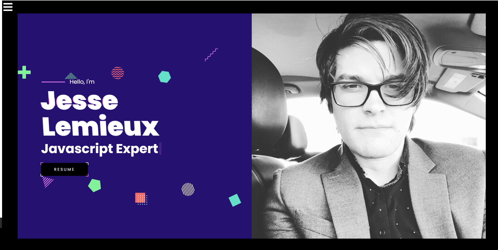
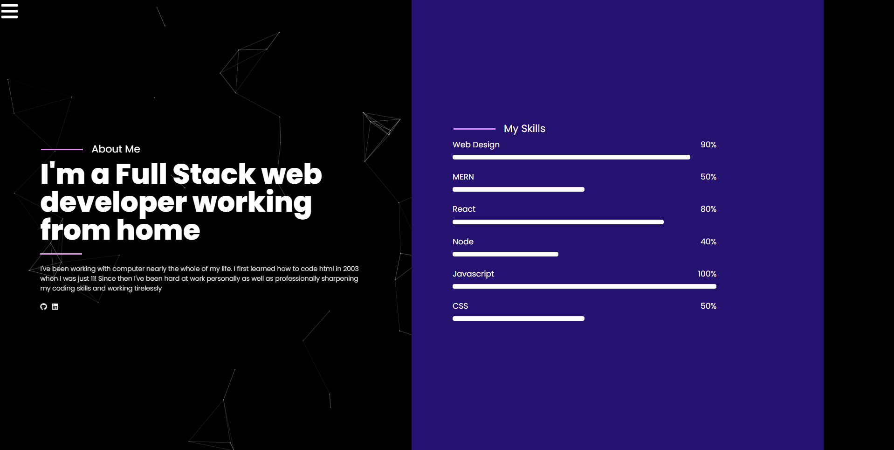
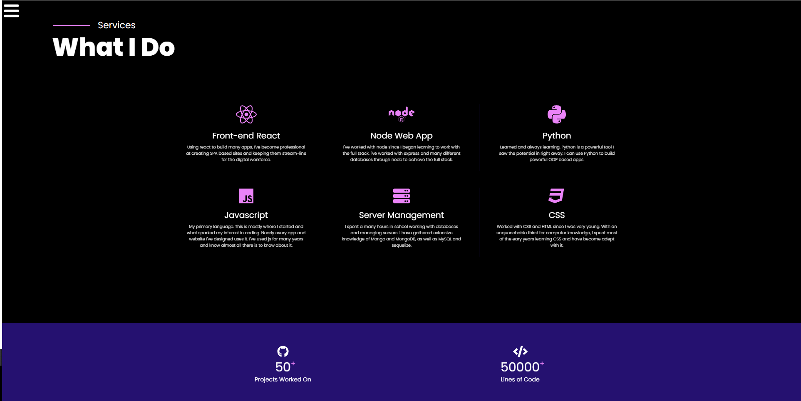
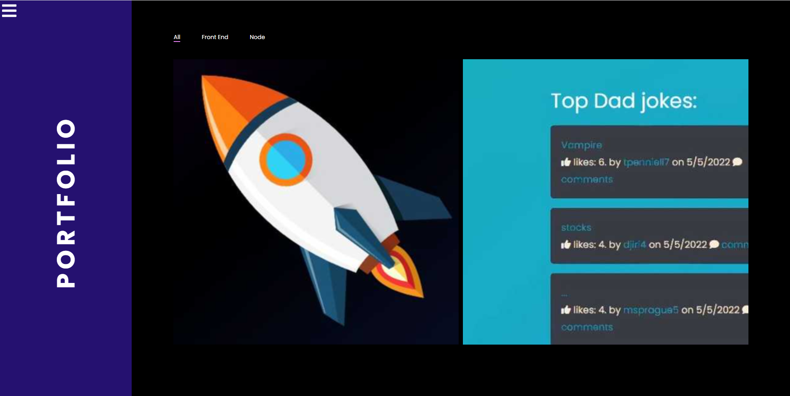
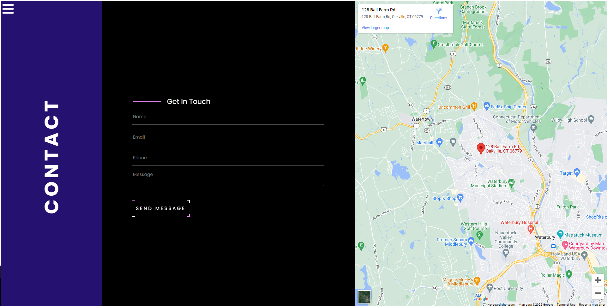
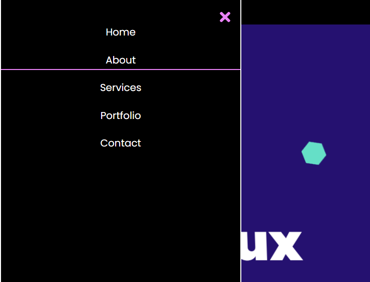

# Jesse Lemieux's Portfolio

## Description

A professional portfolio build with react, by Jesse Lemieux. My motivation was to create a SPA portfolio website using react. I built this project so
so I could have a professional showcase of my coding skills as well as a landing place for future potential employers to get to know a little about me.
Some problems I solved during development were:
- Creating a sound SPA envirnment using react
- Using technologies and frameworks froms other libraries(using any and all tools at my disposal)

Some things I learned during development were:
- Using Gatsby and React together to build a SPA website

## Installation

## [LINK TO LIVE SITE HERE.](https://secure-cliffs-02772.herokuapp.com/)

## Usage

Here is the landing page:

About me: 

Quick summerization of my skills here:

Portfolio with just a couple samples of my work (I will populate more when I have more professional projects completed)

Contact section:

What the collapsible nav bar looks like: 

## Credits

Website was created by Jesse Lemieux.
Email me at dtrsjesse121@gmail.com. 
My [GitHub here.](https://github.com/Jesse-Lemieux))
